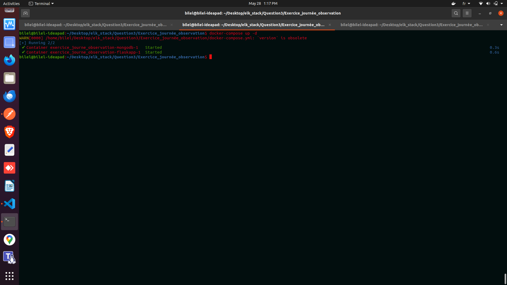
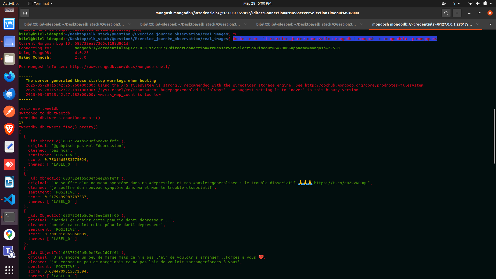
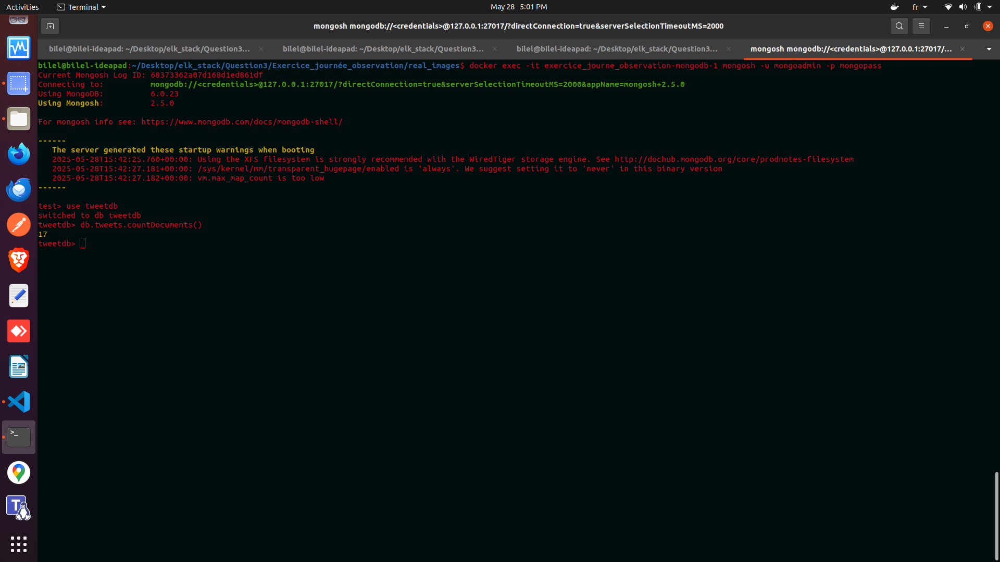
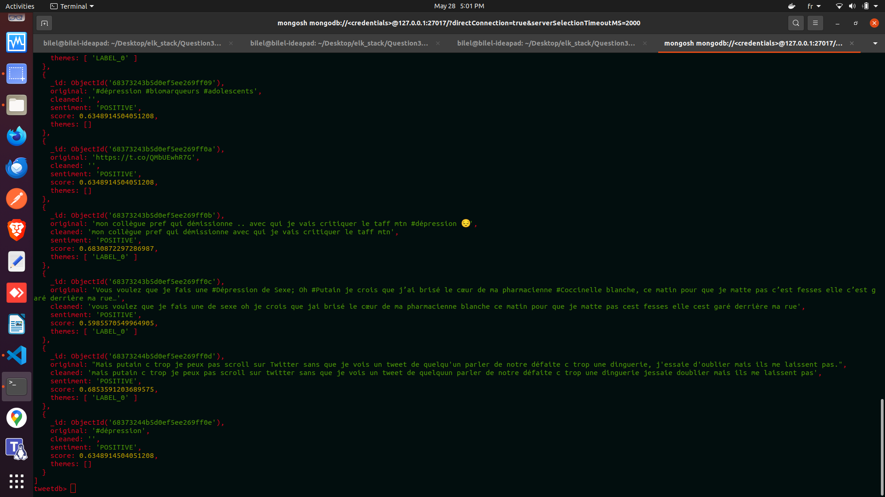
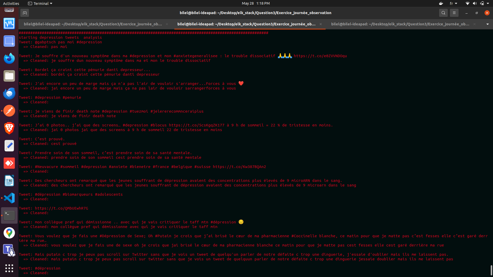
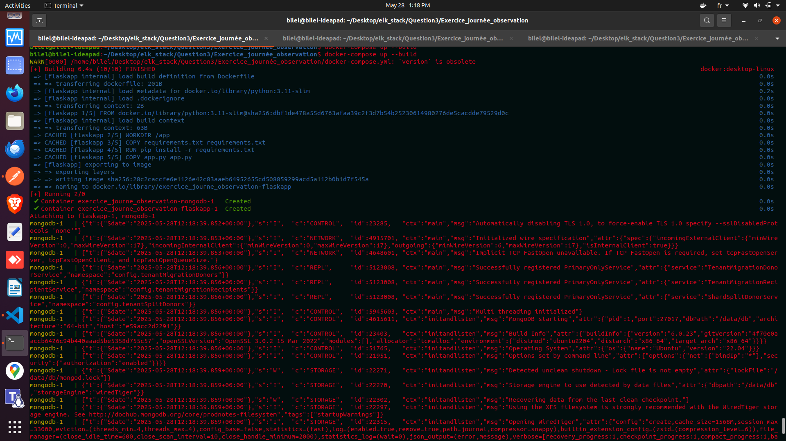
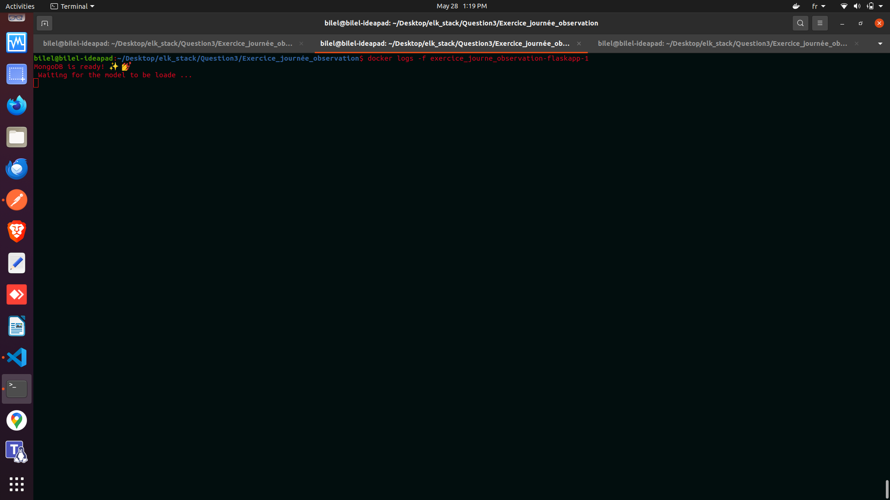
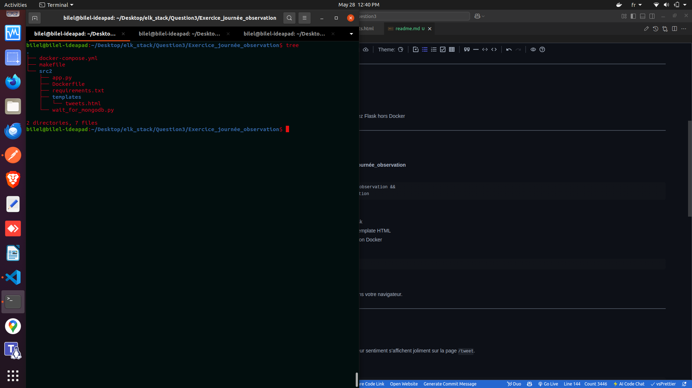

# Analyse des Tweets avec Flask, Mongodb et Docker

Ce projet analyse des tweets  sur la dépression, affiche leur sentiment(positif/négatif) et propose une interfaceweb simple pour visualiser les résultas.

---

## Sommaire:

- [Description](#fonctionnalités)
- [Fonctionnalités](#fonctionnalités)
- [Prérequis](#prérequis)
- [Installation &amp; Lancement](#installation--lancement)
- [Utilisation](#utilisation)
- [Structure du projet](#structure-du-projet)
- [Troubleshooting ](#dépannage)
- [Liens vers des modèles  sur Hugging Face](#dépannage)

## Description de l'application:

* J’ai créé une liste de tweets a analyser.
* Avant l’analyse, j’ai effectué un nettoyage des données (cleaning) sur les tweets en utilisant des **regex** pour enlever les caractère spéciaux, les liens, mentions, etc., afin d’améliorer la qualité des résultat
* Ensuite,j’ai développe une app flask qui effectue une analyse de sentiment et détecté les thèmes sur chaque tweet nettoyé, en utilisant les modèles Huggingface(neuroapps/sentiments_classifier et JTH/twitter_classification ).
* Pour faciliter le déploiement,j’ai créé un Dockerfile pour construire l’image de l’application Flask.
* J’ai aussi configuré un docker-compose.yml qui lance deux service :

  * flaskapp (l’application Flask  )
  * mongodb (la base de données  )
* Afin d’assurer que l’application Flask ne démarre  qu’après le lancement de MongoDB , j’ai ajouté un script wait_for_mongodb dans le service flasapp.ce script attend la disponibilité de MongoDB avant de lancer l’app Flask, évitant ainsi des erreur de connexion

---

## Fonctionnalités

- Nettoyage et normalisation de tweets.
- Analyse de sentiment via un modèle HuggingFace.
- Affichage des résultats dans les logs et sur une page web HTML/CSS.
- Déploiement  avec Docker_Compose (Flask + MongoDB)

---

## Prérequis

- [Docker](https://docs.docker.com/get-docker/)
- [Docker_Compose
  ](https://docs.docker.com/compose/install/)

---

## Installation & Lancement

1. **Crée un dossier nommeExercice_journée_observation**

```bash
Linux: mkdir Exercice_journée_observation &&
   cd Exercice_journée_observation
```

2. **Vérifiez la struture**

   - `src2/app.py` : code principal flask
   - `src2/templates/tweets.html` : template HTML
   - `docker-compose.yml and dockerfile`: configuration Doker
3. **Lancez les services**

   ```bash
   docker-compose up --build
   mongo conatainer 
   docker exec -it exercice_journe_observation-mongodb-1 mongosh -u mongoadmin -p mongopas
     use tweetdb 
     db.tweets.countDocuments()
     db.tweets.find().pretty()
   flask container 
   docker exec -it exercice_journe_observation-flaskapp-1 
   docker logs -f exercice_journe_observation-flaskapp-1 

   ```

   Cela démarre MongoDB et Flask.

   
   
   
   
   
   
   
   
4. **Accédez à l’application et mongo database**
   Ouvrez [http://localhost:8000/tweet](http://localhost:8000/tweet) dans votre navigateur.

   

---

## Utilisation

- **Page Web** :Les tweets, leur version nettoyée et leur sentiment s’affichent joliment sur la page `/tweet`.
- **Logs en temps réel  et controle leur container via makefile et dokcer-compose :**
  Pour voir les détails dans le terminal :

  ```docker

  controle via docker-compose:
      docker-compose up -d
      docker-compose build
      docker-compose down 
      docker exec  -it exercice_journe_observation-flaskapp-1 bash


  ###########################################################################

  Contrôle via makefile
    make DOC_UP
    make DOC_BUILD
    make DOC_DOWN
    make flask_container
    make log_flask_container
    make List_docker_container
  #############################################################################

  docker exec -it exercice_journe_observation-mongodb-1 mongosh -u mongoadmin -p mongopass
  docker logs -f exercice_journe_observation-flaskapp-1

  ```

## Structure du projet



# Troubleshooting

### 2. Problèmes de port (Port)

* **Error** : Port déjà utilisé et le port est déjà occupé par un autre service.
* **Solution** :
  * Identifiez quel service utilise ce port (`lsof -i :27017` sur Linux).
  * Changez le port dans votre configuration Docker et application.
  * Libérez le port en arêtant le service qui l’occupe.

---

### 3. Probl&me avec le token Twitter (API)

* **Erreur** : Authentifiation échouée ou delai d’attente.
* **Cause probable** :
  * Token expiré ou invalide.
  * Limite de requêtes atteinte.
  * Mauvaise gestion des exceptions dans le code.
* **Solution** :
  * Vérifiez que le token est valide et à jour.
  * Implémentez la gestion des erreurs et des retries dans votre code.
  * Respectez les limites d’API (rate limits).

---

### 4. Problèmes d’analyse de sentiments (Sentiment Analysis)

* **Erreur** : Modèle Huggingface met trop detemps à répondre ou génère une erreur.
  * chargement du modele lent.

### 5. Liens vers des modèles  sur Hugging Face

https://huggingface.co/JTH/twitter_classification?library=transformers

https://huggingface.co/neuroapps/sentiments_classifier=transformers

## **Les captures d’écran** des problèmes et


**Remarque :**

certaines explications ou parties d'exercice n'ont pas pu etre rédigées ou ajoutée dans ce README par manque de temps. Merci de votre compréhension.
